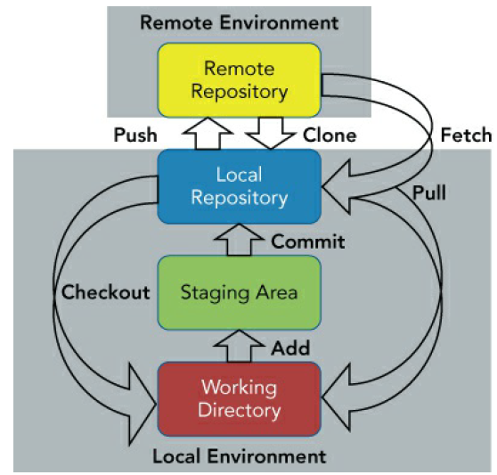

Enter a text in file test.py

```
echo "version 1" >> test.py
```{{ execute T1 }}

Add the file in workspace 
```
git add .
```{{ execute T1 }}

by committing the file, it moves to a staging area
```
git commit -m"first init"
```{{ execute T1 }}

```
git log
```{{ execute T1 }}

you can change your commit message with the --amend switch 
```
git commit --amend -m "first initial commit"
```{{ execute T1 }}

check the git log file 
```
git log
```{{execute T1}}

display one line only
```
git log --oneline
```{{execute T1}}

You can see the commit ID, the strange-looking name SHA1 is an acronym for Secure Hashing
Algorithm 1. In short, it's a checksum of 40 hexadecimal digits. It has its roots in the MD5
implementation if you're familiar with that.

show all files involved in the commit

```
git show --pretty=%gd --stat
```{{execute T1}}

or 
```
git show --name-only --oneline 
```{{execute T1}}

You could set an alias 
```
alias gits='git show --name-only --oneline'
```{{execute T1}}

or you could create a git alias 
```
git config --global alias.changes 'show --stat --oneline'
```{{execute T1}}
and 
```
git changes 
```{{execute T1}}

