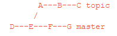

join two or more development histories together

Incorporates changes from the named commits (since the time their histories diverged 
from the current branch) into the current branch. This command is used by git pull to incorporate changes 
from another repository and can be used by hand to merge changes from one branch into another.

Assume the following history exists and the current branch is "master":



Then "git merge topic" will replay the changes made on the topic branch since it diverged from master (i.e., E) until its current commit (C) on top of master, 
and record the result in a new commit along with the names of the two parent 
commits and a log message from the user describing the changes.


## Give some info to git regarding your identity
Set your email and user name
```
git config --global user.email "dockerlite@gmail.com"
```{{ copy }}
Right click on the console and paste  
Change the email address   
```
git config --global user.name "Herve"
```{{ copy }}
Right-click on the console and paste   
Put your name   

We are going to set up an complete git environment suitable for a professional usage
clone this repo 
```shell
git clone https://git.eclipse.org/r/jgit/jgit
```{{ execute T1 }}

```shell
cd jgit
```{{ execute T1 }}

The purpose of the “git reset” command is to move the current HEAD to the commit specified 
```shell
git checkout master && git reset --hard b14a939
```{{ execute T1 }}

Create a bunch of alias commands 
```
git config --global alias.co checkout
```{{ execute T1 }}

git config --global alias.br branch  
git config --global alias.ci commit  
git config --global alias.st status  
git config --global core.editor "vi"  

Check 
```
git st
```{{ execute T1 }}

One of the command Git aliases needed is unstage  
```
git config --global alias.unstage 'reset HEAD --'
```{{ execute T1 }}

Try to edit the README.md file in the root of the jgit repository and add it
to the root.

Check with git st
and unstage it using the alias

A common use cas for aliases is to format the history of Git 
```
git config --global alias.ll 'log --pretty=format:"%C(yellow)%h%Cred%d%Creset%s %Cgreen(%cr) %C(bold blue)<%an>%Creset" --numstat'
```{{ execute T1 }}

Check 
```
git ll
```{{ execute T1 }}

yo can create a external command instead of a Git command 
This command will be used for resolving conflits from a rebase or merge 
This will bring up  an editor with all files that are in the conflit state due to a merge/rebase.
edit the file  ~/.gitconfig

in an alias section copy/paste 

```
editconflicted= "!f() { git ls-files --unmerged | cut -f2 | sort -u ; } ; f | xargs -o $EDITOR"
```{{ copy }}

Create two branches 
```
git branch A 03f78fc
```{{ execute T1 }}

```
git branch B 9891497
```{{ execute T1 }}

move to branch A
```
git checkout A
```{{ execute T1 }}

Merge B to A 
Check 
```
git merge B
```{{ execute T1 }}

Check all files involved in a conflict

```
git editconflicted
```{{ execute T1 }}

