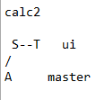
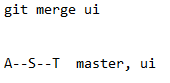
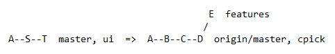
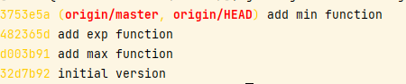
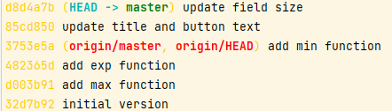
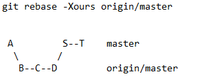
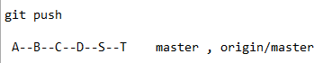

Change to the calc2 subdirectory.
```
cd ~  && cd calc2
```{{ execute T1 }}

```
git log --oneline
```{{ execute T1 }}

```
git branch -av
```{{ execute T1 }}

```
git branch ui origin/ui
```{{ execute T1 }}

Check but only master branch

```
git log --oneline
```{{ execute T1 }}

Check branch ui 

```
git log --oneline ui
```{{ execute T1 }}




Merge the ui branch into master. (If you are not still on master,
check out master first.)
```
git merge ui
```{{ execute T1 }}

Git apply a fast-foward merge



Assuming the merge is successful, push the updates out to the
remote.

```
git push origin master
```{{ execute T1 }}




Your push is rejected. This is because the push done by the other
user (as simulated when you were working in calc_other) changed
the same commit and was pushed before you pushed your updates.
Git determines that it can’t do a fast-forward merge and so rejects
the push.

try the suggestion that Git offers and do a pull to see if it can merge
cleanly.

```
git pull origin master
```{{ execute T1 }}

Notice again that you have a merge conflict. You could certainly go
into the file and edit it to resolve the various merge conflicts. Or,
you could use one of the merge strategies to force choosing one
version or the other. However, in this case, you decide to
incorporate the history as well. That points you toward another
option: a rebase. Before you can try that, you need to abort this
merge.

```
git merge --abort
```{{ execute T1 }}


Now you can get the updated content without having Git try to
merge it locally. Recall that the fetch command updates the remote
tracking branches but not the local branches. So, you execute a
fetch command.

```
git fetch
```{{ execute T1 }}

check 
```
git log --oneline
```{{ execute T1 }}


```
git log --oneline origin/master
```{{ execute T1 }}



You are now ready to try the rebase. If all goes well, this operation
will rebase locally off of the updated content from the master in the
remote tracking branches. Run the following command (making
sure you are in the master branch when you do so):
```
git rebase origin/master
```{{ execute T1 }}

Once again, conflicts arise. Because the changes are different,
between adding functionality and changing ui features, you can
make an **educated guess** that if you just keep the current changes
and apply the other changes on top of them, you won’t run into
critical conflicts. So, you can tell Git to keep your changes if there
are perceived conflicts. The easiest way to do that is to add the **-
Xours option**. Recall that this option passes the “keep ours if
there’s a conflict” option to the *default recursive strategy*. Abort the
current rebase operation, and run the command again with the
extra option.

```
git rebase --abort
```{{ execute T1 }}

```
git rebase -Xours origin/master
```{{ execute T1 }}

Do a quick git log to see if the commits look correct.
```
git log --oneline
```{{ execute T1 }}

Result of -Xours



Graph 



Note that all of the commits that you would expect are now there.
Try pushing these updates over to the remote side again.
```
git push
```{{ execute T1 }}



