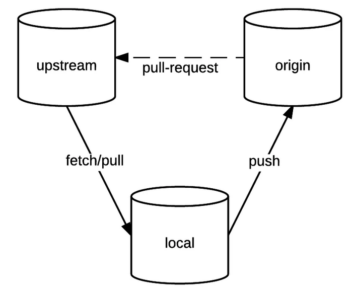

This picture depicts how to set a project under a pull-request workflow
We will focus on the triangular workflow situation, i.e. working with 3 repositories:



A reference repository, conventionally called *upstream*  
This is the repository of the project we want to contribute to.  
We only have read rights to it.  

A fork repository, conventionally referenced *origin*  
This is a copy of the reference repository.  
We have all rights to it.  

*A local repository*  
This is our working repository.  

Fork in your first user github account the following repo
https://github.com/system-dev-formations/python_epidemic_simulations.git

## Give some info to git regarding your identity
Set your email and user name
```
git config --global user.email "dockerlite@gmail.com"
```{{ copy }}
Right click on the console and paste  
Change the email address   
```
git config --global user.name "Herve"
```{{ copy }}
Right-click on the console and paste   
Put your name   

### set up the triangular workflow

Go to your home directory
```
cd ~
```{{ execute T1 }}

clone a personal copy of the forked repo
```shell
git clone https://github.com/<your_current_account>/python_epidemic_simulations.git
```{{ copy }}

```
cd python_epidemic_simulations
```{{ execute T1 }}


### set up the triangular workflow
check 
```
git remote -v 
```{{ execute T1 }}

Add an upstream 
```
git remote add upstream https://github.com/system-dev-formations/python_epidemic_simulations.git
``` {{ execute T1}}

check 
```
git remote -v
```{{ execute T1 }}

You have to sync our current repo with the upstream repo 
```
git fetch upstream 
```{{ execute T1 }}

Checkout 
```
git checkout master 
```{{ execute T1 }}

merge upstream to local master 
```
git merge upstream/master 
```{{ execute T1 }} 

Change the file constants.py
Check 
```
git status
```{{ execute T1 }}
 
check 
```
git diff
```{{ execute T1 }} 

do a fast commit with the switch -am
```
git commit -am"Added a docs"
```{{ execute T1 }}

check 
 ```
git log --oneline
```{{ execute T1 }}

**At this point the trainer should manage the pull-request on its own due to permission rights on the upstream repo**
 