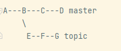
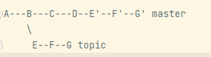

git rebase takes your current branch and rewrites a series of
its own tip commits in one way.  

example of initial state:  



go to topic by doing *git checkout topic*   
and *git rebase master*  


 

using cherry-pick, go to master  *git checkout master*   
run *git cherry-pick topic~3..topic*  



the commits from topic were copied into master  

Both cherry-pick and rebase do very similar things;   

in our repo we can use rebase to incorporate the exp and min functions.
get the commit ID of min function 
```shell
git log features --oneline
```{{ execute T1 }}

rebase
```shell
git rebase 3753e5a
```{{ execute T1 }}
