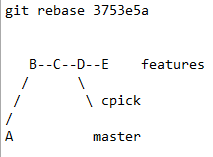
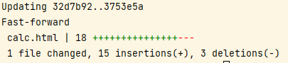
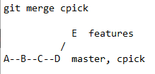
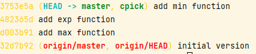

git rebase takes your current branch and rewrites a series of
its own tip commits in one way.  




Both cherry-pick and rebase do very similar things;   

in our repo we can use rebase to incorporate the exp and min functions.
get the commit ID of min function 
```shell
git log features --oneline
```{{ execute T1 }}

rebase
```shell
git rebase 3753e5a
```{{ execute T1 }}

check 

```
git log --all --decorate --oneline --graph
```{{ execute T1 }}

Now that you have your code as desired in the cpick branch, you’re
ready to merge that branch back into the master branch. Run the
following commands:

```
git checkout master
```{{ execute T1 }}

```
git merge cpick
```{{ execute T1 }}




When you try to merge one commit with a commit that can be reached by following the first commit’s history, 
Git simplifies things by moving the pointer forward because there is no divergent work to
merge together – this is called a “fast-forward.”
To avoid fast-forward and create a merge commit use git merge --no-ff

check 
```
git log --all --decorate --oneline --graph
```{{ execute T1 }}




Once the merge is complete, push the changes out to the remote repo in github.
we can see origin/master is behind of HEAD->measter and cpick
 


```
git push
```{{ execute T1 }}


