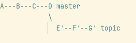

git rebase takes your current branch and rewrites a series of
its own tip commits in one way.  

example of initial state:  


go to topic by doing *git checkout topic*   
and *git rebase master*  



 

using cherry-pick, go to master  *git checkout master*   
run *git cherry-pick topic~3..topic*  


the commits from topic were copied into master  

Both cherry-pick and rebase do very similar things;   

in our repo we can use rebase to incorporate the exp and min functions.
get the commit ID of min function 
```shell
git log features --oneline
```{{ execute T1 }}

rebase
```shell
git rebase 3753e5a
```{{ execute T1 }}

check 

```
git log --all --decorate --oneline --graph
```{{ execute T1 }}

Now that you have your code as desired in the cpick branch, you’re
ready to merge that branch back into the master branch. Run the
following commands:

```
git checkout master
```{{ execute T1 }}

```
git merge cpick
```{{ execute T1 }}

Once the merge is complete, push the changes out to the remote.

```
git push
```{{ execute T1 }}


